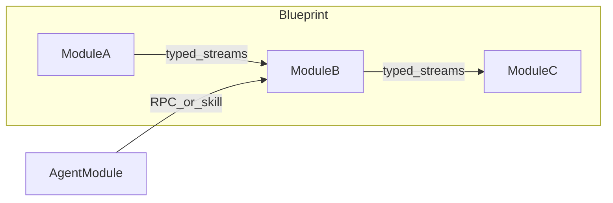

# DimOS 项目说明（中文）

本文档是一份**索引型总览**：帮助你在较短时间内建立「仓库里有什么、代码大致在哪、如何继续深入」的心智模型。实现细节请以英文为主的专题文档为准（文中均已给出链接）。

---

## 1. 项目简介

**DimOS（Dimensional）** 是一套面向通用机器人软件栈的框架：用 Python 将感知、地图、导航、控制、操纵与 Agent 等子系统组合成可运行的 **Blueprint（蓝图）**，模块之间通过类型化的 **Stream（流）** 通信，并可选接入 **LLM Agent** 与 **MCP** 工具调用。

典型使用方式：

- **真机**：指定机器人 IP、运行对应 blueprint（如 Unitree Go2 / G1）。
- **回放（replay）**：无需硬件，用录制数据驱动感知与导航等链路。
- **仿真（simulation）**：在 MuJoCo 等仿真环境中运行完整或部分栈。

项目描述与版本信息见仓库根目录 [`pyproject.toml`](../pyproject.toml) 与 [`README.md`](../README.md)。

---

## 2. 仓库顶层结构（注意区分「仓库根」与 Python 包目录）

| 路径 | 说明 |
|------|------|
| [`dimos/`](../dimos/) | **Python 包源码根目录**（包名亦为 `dimos`）。下文第 3 节按功能域拆解。 |
| [`docs/`](../docs/) | 使用指南、能力说明、平台文档、安装与开发文档（多为英文）。 |
| [`examples/`](../examples/) | 示例与语言互操作（如 C++/TS/Lua）demo。 |
| [`docker/`](../docker/) | 容器相关配置与说明。 |
| [`bin/`](../bin/) | 辅助脚本（如 CI / 测试入口）。 |
| [`scripts/`](../scripts/) | 安装与其他运维脚本。 |
| [`data/`](../data/) | 示例或测试用数据（具体用途以目录内说明为准）。 |
| [`assets/`](../assets/) | README 等用到的静态资源。 |
| [`AGENTS.md`](../AGENTS.md) | **Agent / `@skill` / MCP / Spec 注入** 等开发的浓缩参考（强烈建议 Agent 相关开发从这里入手）。 |
| [`flake.nix`](../flake.nix)、[`uv.lock`](../uv.lock) | Nix 与 `uv` 锁定的依赖与环境声明；Python 依赖主清单在 [`pyproject.toml`](../pyproject.toml)。 |

---

## 3. `dimos` Python 包功能地图

下列分组描述「这一目录大致负责什么」。子模块众多，深入时请结合源码与 [`docs/usage/`](usage/README.md)。

### 3.1 运行时内核与通信

| 目录 | 职责概要 |
|------|----------|
| [`dimos/core/`](../dimos/core/) | **Module** 基类、`In`/`Out` 流声明、**Blueprint** 组合、`GlobalConfig`、worker / forkserver 等运行时核心。 |
| [`dimos/stream/`](../dimos/stream/) | 流相关抽象与媒体类扩展（如音视频路径）。 |
| [`dimos/protocol/`](../dimos/protocol/) | 传输与协议实现分层（pub/sub、RPC、编码等）；与 [`docs/usage/transports/`](usage/transports/index.md) 对应。 |
| [`dimos/spec/`](../dimos/spec/) | 模块间 **Spec（Protocol）** 类型与注入辅助，用于编译期友好的 RPC 依赖声明。 |

### 3.2 消息与类型

| 目录 | 职责概要 |
|------|----------|
| [`dimos/msgs/`](../dimos/msgs/) | 各类消息类型（geometry、sensor、nav、visualization 等与 ROS 风格对齐的命名）。 |
| [`dimos/types/`](../dimos/types/) | 通用类型与辅助定义。 |

### 3.3 机器人、CLI 与硬件

| 目录 | 职责概要 |
|------|----------|
| [`dimos/robot/`](../dimos/robot/) | **各厂商机器人集成**：Unitree（Go2、G1、B1 等）、无人机、机械臂 blueprint；**CLI 入口**在 [`dimos/robot/cli/`](../dimos/robot/cli/)（`dimos` 命令）。蓝图注册表 [`dimos/robot/all_blueprints.py`](../dimos/robot/all_blueprints.py) 为自动生成，勿手改（见 [`AGENTS.md`](../AGENTS.md) 与下文第 7 节）。 |
| [`dimos/hardware/`](../dimos/hardware/) | 传感器、执行器、底盘等硬件抽象与驱动相关代码。 |

### 3.4 感知与模型

| 目录 | 职责概要 |
|------|----------|
| [`dimos/perception/`](../dimos/perception/) | 检测、跟踪、融合及实验性感知（如 temporal memory）。 |
| [`dimos/models/`](../dimos/models/) | 视觉语言模型（VLM）、分割、嵌入等模型侧封装。 |

### 3.5 地图与记忆

| 目录 | 职责概要 |
|------|----------|
| [`dimos/mapping/`](../dimos/mapping/) | 占据栅格、点云、OSM / 地图工具等。 |
| [`dimos/memory/`](../dimos/memory/) | 时空记忆、序列化存储相关模块。 |

### 3.6 导航与控制

| 目录 | 职责概要 |
|------|----------|
| [`dimos/navigation/`](../dimos/navigation/) | 路径规划、前沿探索、视觉导航等。 |
| [`dimos/control/`](../dimos/control/) | 控制律与任务示例代码。 |

### 3.7 操纵与技能组合

| 目录 | 职责概要 |
|------|----------|
| [`dimos/manipulation/`](../dimos/manipulation/) | 规划、抓取、伺服控制等操纵链路。 |
| [`dimos/skills/`](../dimos/skills/) | 按场景组织的技能或 REST 相关组合（与 Agent 暴露的 skill 配合使用时需对照具体 blueprint）。 |

### 3.8 仿真

| 目录 | 职责概要 |
|------|----------|
| [`dimos/simulation/`](../dimos/simulation/) | MuJoCo、Isaac、Genesis 等仿真引擎适配与工具。 |

### 3.9 Agent、MCP 与遗留代码

| 目录 | 职责概要 |
|------|----------|
| [`dimos/agents/`](../dimos/agents/) | **Agent** 模块（如 LangGraph）、系统提示词、**`@skill` 装饰器**、通用技能容器、[**MCP** 服务端/客户端](../dimos/agents/mcp/) 等。 |
| [`dimos/agents_deprecated/`](../dimos/agents_deprecated/) | 旧版 Agent 相关代码；**新功能请勿依赖此路径**。 |

### 3.10 可视化、Web 与遥操作

| 目录 | 职责概要 |
|------|----------|
| [`dimos/visualization/`](../dimos/visualization/) | 如 Rerun 桥接等可视化集成。 |
| [`dimos/web/`](../dimos/web/) | Web UI、接口与扩展（各子目录常有独立 README）。 |
| [`dimos/teleop/`](../dimos/teleop/) | 键盘、手机、Quest 等遥操作入口。 |

### 3.11 工具、测试与其他

| 目录 | 职责概要 |
|------|----------|
| [`dimos/utils/`](../dimos/utils/) | 日志、CLI 辅助、测试工具等横切能力。 |
| [`dimos/e2e_tests/`](../dimos/e2e_tests/) | 端到端测试。 |
| [`dimos/exceptions/`](../dimos/exceptions/) | 公共异常类型。 |
| [`dimos/rxpy_backpressure/`](../dimos/rxpy_backpressure/) | 与 ReactiveX 背压相关的内部实现。 |

---

## 4. 核心概念（精简）

- **Module（模块）**：独立子系统，声明 `In[T]` / `Out[T]` 流与 `@rpc` 方法，运行在 worker 进程中。详见 [模块系统](usage/modules.md)。
- **Stream（流）**：模块间发布/订阅的 typed 数据通道；高级主题见 [传感器流 / 数据流](usage/sensor_streams/README.md)、[数据流](usage/data_streams/README.md)。
- **Blueprint（蓝图）**：用 `autoconnect()` 等将多个模块实例组合并自动按名称与类型连线。详见 [Blueprints](usage/blueprints.md)。
- **RPC**：模块间远程过程调用；可将依赖声明为 **Spec** 以便构建期校验（[`AGENTS.md`](../AGENTS.md)）。
- **`@skill`**：暴露给 LLM 的工具型 RPC（需 docstring 与完整类型标注）。详见 [Agents 文档索引](agents/index.md) 与 [`AGENTS.md`](../AGENTS.md)。
- **Agent**：基于语言模型、可订阅流并调用 skills 的模块；MCP 场景下需 blueprint 中包含 `McpServer` 等（见 [`AGENTS.md`](../AGENTS.md)）。

概念总入口：[docs/usage/README.md](usage/README.md)。

### 架构示意（Blueprint → 模块 → 流 → Agent）

---

## 5. 能力与平台文档索引

中文读者可先看本节一句话导读，再点开英文专题。

| 主题 | 导读 | 链接 |
|------|------|------|
| 导航 | SLAM、代价地图、规划、探索等 | [capabilities/navigation/readme.md](capabilities/navigation/readme.md) |
| 感知 | 检测、3D、音频、VLM 等 | [capabilities/perception/readme.md](capabilities/perception/readme.md) |
| 操纵 | 机械臂、规划与自定义手臂扩展 | [capabilities/manipulation/readme.md](capabilities/manipulation/readme.md) |
| Agent | 工具调用、MCP、系统提示词 | [capabilities/agents/readme.md](capabilities/agents/readme.md) |
| 平台 | 如 Go2、G1 等平台级说明 | [platforms/quadruped/go2/index.md](platforms/quadruped/go2/index.md)、[platforms/humanoid/g1/index.md](platforms/humanoid/g1/index.md) |

---

## 6. CLI 与典型工作流

命令行由 [`dimos/robot/cli/`](../dimos/robot/cli/) 提供，常用流程：

- `dimos list`：列出可用 blueprint。
- `dimos run <blueprint>`：启动栈；可加 `--daemon`、`--replay`、`--simulation`、`--robot-ip` 等（与 `GlobalConfig` 字段对应）。
- `dimos status` / `dimos log` / `dimos stop`：查看运行状态、日志与停止。
- `dimos agent-send "..."`：向运行中的 Agent 发送自然语言指令。
- `dimos mcp list-tools | call | status | modules`：**仅当** blueprint 包含 **McpServer** 时可用（当前以 `unitree-go2-agentic-mcp` 等为参考），详见 [`AGENTS.md`](../AGENTS.md)。

完整 CLI 说明：[docs/usage/cli.md](usage/cli.md)。Blueprint 组合与约定：[docs/usage/blueprints.md](usage/blueprints.md)。

---

## 7. 开发与质量

- **测试**：快速测试与 CI、marker 约定见 [development/testing.md](development/testing.md)。
- **蓝图注册**：新增或重命名 blueprint 后需按 [`AGENTS.md`](../AGENTS.md) 所述运行 `pytest dimos/robot/test_all_blueprints_generation.py` 以更新 `all_blueprints.py`，否则 CI 可能失败。
- **代码风格**：仓库使用 pre-commit（ruff、license 等）；提交前请在虚拟环境中激活并完成检查（[`AGENTS.md`](../AGENTS.md)）。
- **可视化**：Rerun / Foxglove 等见 [usage/visualization.md](usage/visualization.md)。

---

## 8. 延伸阅读（按阅读顺序）

1. 仓库根 [`README.md`](../README.md)：安装、精选 run 命令与硬件表。  
2. [`AGENTS.md`](../AGENTS.md)：模块、Blueprint、Skill、MCP、Spec 的快速手册。  
3. [docs/usage/README.md](usage/README.md)：Module / Stream / Blueprint / RPC / Skill 概念导航。  
4. [docs/agents/index.md](agents/index.md)：Agent 系统文档入口。

若你发现本文档与源码或英文文档不一致，**以源码与英文专题文档为准**，并欢迎提交修正。
